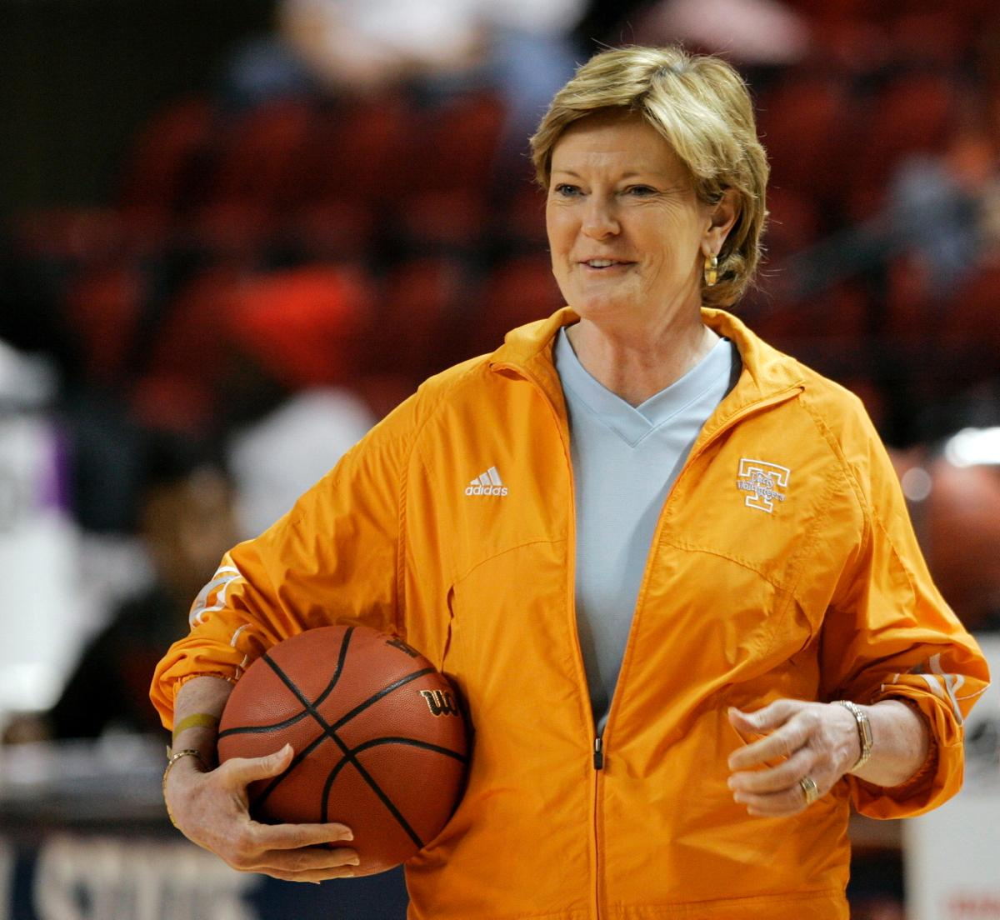

```{r setup, include=FALSE}
library(shiny)
library(flexdashboard)
library(tidyverse)
library(maps)
library(plotly)
library(plyr)
library(leaflet)
library(scales)
knitr::opts_chunk$set(echo = TRUE)
summaryData <- read.csv(file="data/summary_stats.csv", header = TRUE)
breakdownBySportData <- read.csv(file="data/breakdown_by_sport_denormalized.csv", header = TRUE)
breakdownBySchoolData <- read.csv(file="data/breakdown_by_school.csv", header = TRUE)
```

Overview
==========================

Column
-------------------------
<div style="height:25%">
“Women Coaches matter for a variety of reasons. Research shows that same sex role models positively influence self-perceptions. They challenge stereotypes about gender and leadership and offer diverse perspectives, insight and advice to their athletes. One hundred percent of male athletes have had a male Coaching role model during their athletic careers, to their benefit; young women likewise need and deserve more same sex role models.”<br>
	- Nicole LaVoi, Ph. D., Director of Tucker Center for Research on Girls & Women in Sport
</div>

<center style="margin-bottom:3rem;">
```{r, echo=FALSE}
summaryData$Percentage <- as.numeric(summaryData$Percentage)
summaryData <- ddply(summaryData, .(Sport.Gender), transform, pos = cumsum(Percentage) - 0.5*Percentage)
fill <- c("#5F9EA0", "#E1B378")
ggplot(summaryData, aes(x=Sport.Gender, y=Percentage, fill=fct_reorder(Coach.Gender, Percentage), label=paste0(Percentage,"%"))) + 
  geom_bar(stat="identity") +
  geom_text(size=4, position = position_stack(vjust = 0.5)) +
  labs(x = "Sport Gender", fill = "Coach Gender") +
  scale_y_continuous(labels = dollar_format(suffix = "%", prefix="")) +
  scale_fill_manual(values=fill)
```
</center>

Contrary to what one might expect with an issue like this, it has actually gotten worse over time. While the passing of Title IX was a monumental achievement in the prevention of sexual discrimination in athletics, ensuring equal funding and opportunities for men and women athletes, its passing inadvertently resulted in a huge shift in the opposite direction for women's coaching opportunities.


Prior to Title IX, about 90% of women's sports were coached by women. When it passed, schools were suddenly required to pay a lucrative salary for coaching women's sports, and many men became interested in and were hired for these jobs, forcing women out of these positions.

Column
-------------------------
<div style="height:33%; margin-bottom: 2rem;">
<center>
  

{width=30%}

</center>
</div>
Across athletics in general, there is a major discrepancy between the number of male and female coaches. Many female athletes grow up without ever having a coach or role model who is the same gender as them. This can result in women not even knowing that coaching is a possible career path for them.


"You can't want to be something there isn't"<br>
	- Carol Hutchins, Softball Coach, University of Michigan


Looking at the NCAA specifically, a serious double standard exists. It is very common for men to coach NCAA women's sports. In fact, only around 40% of women's sports have a woman as head coach. While this means well over half of women's sports are coached by men, it is also exceedingly rare for women to coach men's sports. As of 2019, only around 6.8% of men's sports were head-coached by a woman. Overall, this results in there being 3 times more men than women head coaching across all NCAA Division I sports.


Similarly, around just 20% of NCAA athletic directors are female.


<div style="height:33%; margin-top: 1.7rem;">
<center>
  

{width=50%}

</center>
</div>


Breakdown By Sport
==========================
Column {.sidebar}
-------------------------

Coach gender percentages in equivalent men's and women's NCAA Division I sports.

```{r, echo=FALSE}
selectInput("sport", label = "Sport", choices = c("Basketball" = "Basketball",
                          "Tennis" = "Tennis",
                          "Cross Country" = "Cross Country",
                          "Track, Indoor" = "Track, Indoor",
                          "Track, Outdoor" = "Track, Outdoor",
                          "Baseball and Softball" = "Baseball and Softball",
                          "Volleyball" = "Volleyball",
                          "Golf" = "Golf",
                          "Soccer" = "Soccer",
                          "Ice Hockey" = "Ice Hockey",
                          "Swimming and Diving" = "Swimming and Diving",
                          "Lacrosse" = "Lacrosse",
                          "Gymnastics" = "Gymnastics",
                          "Fencing" = "Fencing",
                          "Skiing" = "Skiing",
                          "Water Polo" = "Water Polo"), selected = "Basketball")
```


Column
-------------------------
### Coach Gender Breakdown By Sport
<div style="height:50%; margin-bottom: 5rem;">
```{r, echo=FALSE}
renderPlot({
if(input$sport == "Baseball and Softball") {
  activeSports <- subset(breakdownBySportData, Sport %in% c("Baseball", "Softball"))
} else {
  activeSports <- subset(breakdownBySportData, Sport %in% c(paste("Men's", input$sport), paste("Women's", input$sport))) 
}
activeSports <- ddply(activeSports, .(Head.Coach.Gender), transform, pos = cumsum(Percentage) - 0.5*Percentage)
ggplot(data=activeSports, aes(x=Sport, y=Percentage, fill=fct_reorder(Head.Coach.Gender, Percentage), label=paste0(Percentage,"%"))) +
    geom_bar(stat="identity") +
    geom_text(size=4, position=position_stack(vjust=0.5)) +
    labs(x = "Sport", fill = "Head Coach Gender") +
    scale_y_continuous(labels = dollar_format(suffix = "%", prefix="")) +
    scale_fill_manual(values=fill) +
    coord_flip()
})
```
</div>

To further exemplify this disparity, it is useful to look at the same (or equivalent counterpart) sports for men and women and the corresponding coaching numbers by gender.


As seen in the chart above, even for the same or very similar sports, the number of men head coaching women's sports often outweighs the number of women head coaching these sports. Furthermore, women coaching men in these sports is exceedingly rare. 


“I look over at the men’s side in sports, and just short of 100 percent of the coaches for men are men. So that’s the culture for men’s sports. I don’t understand why the culture for women’s sports can’t be that women coach and mentor women.” <br>
	-  Jim Donovan, California State University, Fullerton, Athletics Director


***Insert factoid if any men's sports don't have a single woman as head coach***


See the chart below for a comparison of coach genders in other NCAA DI sports:
<div style="height:70%; margin-bottom: 5rem;">
```{r, echo=FALSE}
renderPlot({
  otherSports <- subset(breakdownBySportData, Sport %in% c("Women's Beach Volleyball", "Field Hockey", "Men's Wrestling", "Women's Bowling", "Women's Rowing"))
  otherSports <- ddply(otherSports, .(Head.Coach.Gender), transform, pos = cumsum(Percentage) - 0.5*Percentage)
  ggplot(data=otherSports, aes(x=Sport, y=Percentage, fill=fct_reorder(Head.Coach.Gender, Percentage), label=paste0(Percentage,"%"))) +
    geom_bar(stat="identity") +
    geom_text(size=4, position=position_stack(vjust=0.5)) +
    labs(x = "Sport", fill = "Head Coach Gender") +
    scale_y_continuous(labels = dollar_format(suffix = "%", prefix="")) +
    scale_fill_manual(values=fill)
})
```
</div>

Breakdown By School (Interactive Map)
==========================
```{r, echo=FALSE}
# new column for the popup label
  
  breakdownBySchoolData <- mutate(breakdownBySchoolData, cntnt=paste0('<strong>School: </strong>', School,
                                          '<br><strong>Number of DI Sports:</strong> ', Number.of.DI.Sports,
                                          '<br><strong>Number of Men Head Coaches:</strong> ', Number.of.Men.Head.Coaches,
                                          '<br><strong>Number of Women Head Coaches:</strong> ', Number.of.Women.Head.Coaches,
                                          '<br><strong>Percentage Men Coaches:</strong> ', Percentage.Men.Coaches,
                                          '<br><strong>Percentage Women Coaches:</strong> ', Percentage.Women.Coaches))

# Color palette for shading the points
pal <- colorNumeric(
  palette = "Oranges",
  domain = breakdownBySchoolData$Percentage.Men.Coaches)

# create the leaflet map
renderLeaflet({
    leaflet(breakdownBySchoolData) %>%
    addCircles(lat = ~lat, lng = ~lng) %>%
    addTiles() %>%
    addCircleMarkers(data = breakdownBySchoolData, lat =  ~lat, lng = ~lng,
                     radius = 8, popup = ~as.character(cntnt),
                     color = ~pal(Percentage.Men.Coaches),
                     stroke = FALSE, fillOpacity = 0.8)%>%
    addLegend(pal=pal, values=breakdownBySchoolData$Percentage.Men.Coaches,opacity=1, na.label = "Not Available", title = "Percentage Men Head Coaches")%>%
    addEasyButton(easyButton(
      icon="fa-crosshairs", title="ME",
      onClick=JS("function(btn, map){ map.locate({setView: true}); }")))
})
```